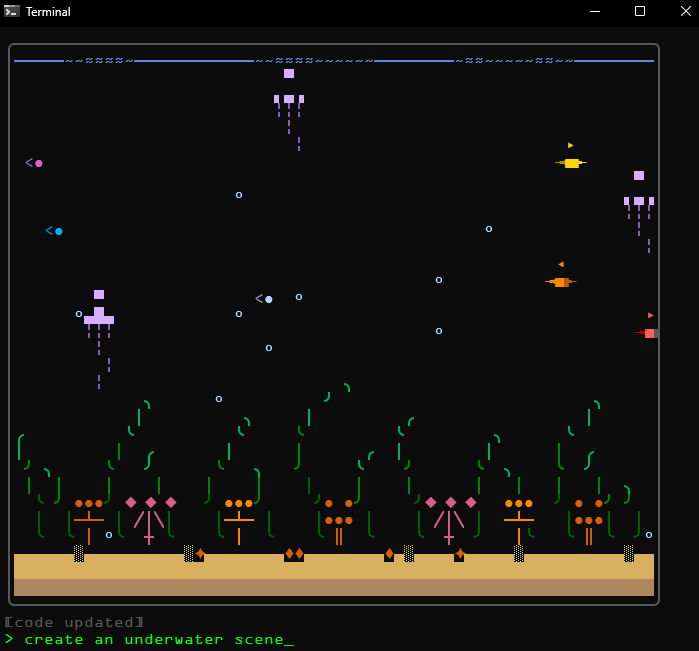
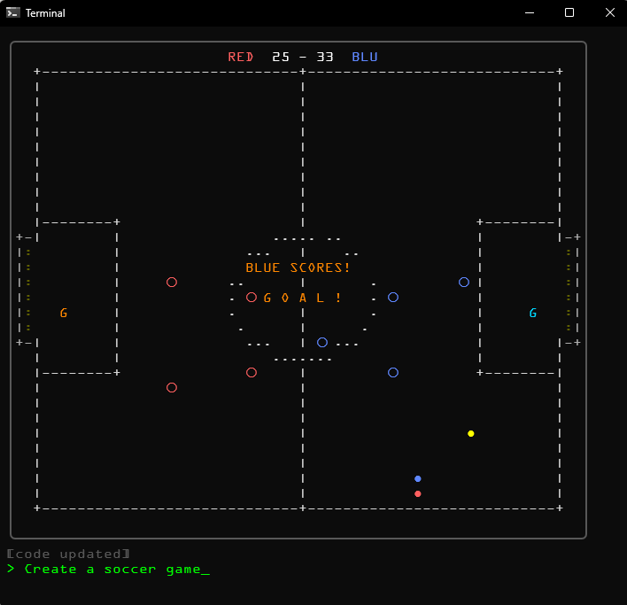

# Droeftoeter

I'm not quite sure what this is exactly.

It's a toy. Maybe a toddler's first coding agent. A poor man's video generator. An experiment in isolating an LLM in a way that it is fun and harmless.

You type what you want to see. A 64x32 character grid comes alive. Each prompt builds on what's already running. The model sees the current code and extends it. `/clear` to start over.

I would love to see someone livecode VJing with droeftoeter on a beamer during an algorave.

## Demo
https://youtu.be/-atrhQ-9Vy8




## Get it

Binaries at [Releases](https://github.com/whtspc/droeftoeter/releases).

Or build from source:

```
go build -o droeftoeter .
```

## Providers

On first launch you pick a provider. Works with:

- **Groq** (free) — Llama models, fast
- **Gemini** (free) — Google's API
- **OpenAI-compatible** — any endpoint (OpenRouter, DeepSeek, etc.)
- **Anthropic** — Claude
- **Ollama** (local) — your own hardware, no API key

Change anytime with `/config`, or set environment variables:

```
DROEFTOETER_PROVIDER=openai
DROEFTOETER_API_KEY=your-key
DROEFTOETER_BASE_URL=https://api.groq.com/openai/v1
DROEFTOETER_MODEL=llama-3.3-70b-versatile
```

Or use a `config.toml` (see `config.toml.example`).


## License

MIT
